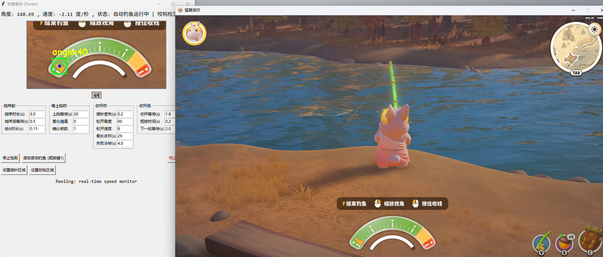
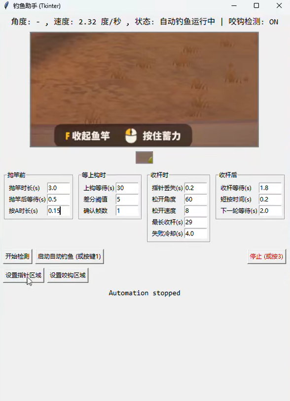

# 🐻🎣 猛兽派对钓鱼助手 Fishing Tool for *Party Animals*



这是一个专门针面对 **《猛兽派对（Party Animals）》钓鱼模式** 的自动化辅助工具。
程序基于 **Python + OpenCV + Tkinter**，通过屏幕截图识别 UI（指针、感叹号提示）并模拟鼠标操作，实现自动抛竿、检测咬钩、收杆等功能。

⚠️ 声明：
本工具仅用于学习与研究 **图像处理与自动化控制**。
在实际游戏中使用可能违反相关规则，请谨慎使用。

---

## 🎥 视频演示

<div align="center">
  <video src="fishing.mp4" controls width="70%"></video>
  <p>如果视频无法播放，请<a href="github_dist/fishing.mp4" download>点击这里下载</a>。</p>
</div>

---

## ✨ 功能特点

<div align="center">
  
</div>

* **自动钓鱼循环**

  * 自动按住鼠标抛竿
  * 等待检测到“咬钩”提示（感叹号头像区域）
  * 自动收杆，实时监测指针角度和转速
  * 完成后自动进入下一轮钓鱼

* **指针检测**

  * 基于 HSV 颜色掩膜
  * 模板匹配（支持旋转角度 ±40°）

* **咬钩检测**

  * 自动匹配感叹号提示（多级缩放匹配）
  * 也可用热键手动触发“有鱼”事件

* **可视化 UI**

  * Tkinter 界面展示实时画面（指针检测 + 掩膜 + 咬钩检测）
  * 提供参数输入框，所有策略参数可实时调整
  * 按钮与全局热键均可控制

---

## ⚙️ 安装依赖

需要 **Python 3.9+**，然后安装依赖：

```bash
pip install opencv-python mss Pillow numpy pyautogui keyboard
```

---

## ▶️ 运行方式

运行脚本：

```bash
python fishing_tool.py
```

或者使用打包好的 `exe` 文件运行，无需安装环境，但仍需准备以下模板文件：

* `pointer_template.png` 👉 指针图案截图（小三角指针）
* `bite_template.png` 👉 咬钩提示截图（感叹号/头像 UI）

首次运行时：

* 默认指针区域为：

  ```json
  {"top": 1010, "left": 1370, "width": 400, "height": 200}
  ```
* 默认咬钩区域为：

  ```json
  {"top": 300, "left": 1400, "width": 300, "height": 300}
  ```

你可以在 UI 中点击 **“设置指针区域”** 或 **“设置咬钩区域”** 手动框选。

---

## ⌨️ 全局快捷键

* **1** ：启动/停止 自动钓鱼循环
* **2** ：手动触发“有鱼”事件（跳过自动检测）
* **3** ：立即停止（紧急中断）

这些快捷键是全局的，不需要切换到程序窗口。

---

## 🖼️ 模板文件

程序依赖 2 张模板图片，需放在脚本同目录下：

* `pointer_template.png` 👉 指针图案截图（小三角指针）
* `bite_template.png` 👉 咬钩提示截图（感叹号/头像 UI）

建议用程序自带的 **“设置区域”** 功能手动框选区域，并配合截图工具裁剪出模板。

---

## ⚙程序参数说明

在 UI 界面中可以调节以下参数：

### 上钩前参数

* **cast\_hold\_time**：抛竿按住时长（秒），默认 `3.0`
* **post\_cast\_wait**：抛竿后等待的间隔（秒），默认 `0.5`

### 等上钩时参数

* **bite\_threshold**：模板匹配阈值，越高越严格，默认 `0.78`
* **max\_bite\_wait**：最长等待上钩时间（秒），超时会重新抛竿，默认 `30`

### 收杆时参数

* **pointer\_loss\_time**：指针丢失判定时间（秒），默认 `0.2`（程序通过张力指针来判断是否处于收杆状态）
* **release\_angle**：当角度小于该值时松开，默认 `60`
* **release\_speed**：指针移动速度超过该值时松开，默认 `10`

### 收杆后参数

* **reel\_end\_wait**：收杆结束后的等待时间（收杆结束要等待手里拿鱼的过程），默认 `1.8`
* **short\_press\_time**：收杆结束后短按鼠标的时间（秒）（因为需要取消拿鱼的状态），默认 `0.2`
* **next\_cast\_sleep**：进入下一轮抛竿前的等待时间（秒），默认 `2.0`

---

## ❓ 常见问题

1. **程序没有检测到指针怎么办？**

   * 请确认 `pointer_template.png` 是否正确截图并放置在脚本目录下。
   * 尝试重新设置指针区域，并调整 HSV 参数。

2. **咬钩检测总是失败？**

   * 请确认 `bite_template.png` 是否为游戏中“感叹号/头像”的截图。
   * 你也可以直接按下 `2` 手动触发“有鱼”。

3. **程序卡顿或响应慢？**

   * 请减少检测区域大小。
   * 调整 UI 刷新间隔 `FRAME_INTERVAL_MS`。

---

## 📜 开源说明

本项目以 **MIT License** 开源，欢迎学习、修改与分享。
请勿将本工具用于违反游戏规则的场景。
